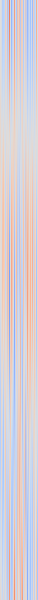

# SCFD Research

Symbolic Coherent Field Dynamics (SCFD) is a variational physics engine for spatial control tasks. This repository collects the SCFD core, evolutionary controllers, and benchmark suite that we use to explore hybrid symbolic?field intelligence. The work is inspired by (and still interoperates with) the Emergent Models (EM) framework: EM provides a Lenia-like cellular baseline, while SCFD adds coherence-preserving dynamics, inverse-gradient energies, and probabilistic gating. Both engines share controllers, diagnostics, and meta-learning corpora so we can compare inductive biases side-by-side.

> **What?s here?** A full SCFD + EM stack, a curated set of spatial control benchmarks, CMA-based vector search tooling, and orchestrator utilities for deploying learned vectors. If you want installation instructions or reproduction scripts, jump to [`docs/DIRECTIONS.md`](docs/DIRECTIONS.md).

## Mathematical Overview

### SCFD Coherence Energy
- State \(u(x, t)\) evolves under a coherence functional \(\mathcal{E}[u]\) that penalises flat spectra and encourages near-critical behaviour.
- The Hamiltonian is discretised with symplectic leapfrog integration. Each step preserves the inverse-gradient penalty and quenched heterogeneity by applying
  \[
  u_{t+1} = u_t + \Delta t \; \mathcal{J}^{-1} 
abla \mathcal{E}[u_t]
  \]
  where \(\mathcal{J}\) is the skew-symmetric symplectic form.
- Controllers act only through local parameters (temperature `T`, gate `alpha`, coherence gain `gamma`) and are constrained by EMA filters and magnitude clips so the energy landscape stays coherent.

### Emergent Models (EM) Baseline
- EM provides a convolutional CA (Lenia-style) with encode?evolve?decode loops.
- Both EM and SCFD expose identical observation stacks, so learned policies can transfer and we can measure expressiveness gaps.
- The orchestrator can probe an environment and decide whether to deploy an SCFD or EM vector based on metadata (physics tags, objective, transform cycles).

### Hybrid Controllers and CMA Vectors
- Controllers maintain hidden encoders (`theta`) that filter observations, then emit local field perturbations respecting SCFD guardrails.
- CMA-ES optimises the controller hyper-vector (encode/decay rates, gains, budget clips, environment parameters). All search scripts now persist rich metadata so downstream tools reconstruct the exact simulation regime.
- Meta-learning runs sweep across the archive (`runs/*/best_vector.json`), sampling tasks for adaptation experiments.

## System Architecture

- `engine/` ? SCFD core: energy densities, symplectic integrators, heterogeneity scheduler.
- `em_baseline/` ? Reference EM implementation for apples-to-apples comparisons.
- `benchmarks/` ? Domain-specific simulators (heat diffusion ARC, routing, fronts, parameter ID, Gray-Scott, flow control, wave shaping, cart-pole, etc.).
- `run/` ? Command-line entry points for CMA training, evaluation runs, robustness batteries, latency profiling.
- `orchestrator/` ? Environment sensing + vector planning utilities.
- `tests/` ? Pytest suite covering simulators, CMA helpers, orchestrator logic, and regression smoke tests.

## Spatial Control Benchmarks

Latest additions (all with metadata-rich vectors):
- **Heat Routing** ? multiple blob transport with collision penalties (`runs/heat_routing_cma`).
- **Heat Front Tracking** ? curvature-bounded propagation (`runs/heat_front_cma`).
- **Heat Parameter ID** ? hidden diffusivity map reconstruction (`runs/heat_param_id_cma`).
- **Heat ARC Transforms** ? rotate/reflect motif pursuit (`runs/heat_arc_cma`).
- Full robustness battery scaffolding lives in `run/robustness_battery.py` and persists cross-domain summaries (`runs/robustness_sample.json`).

## Media

Cart-pole SCFD rollout (controller + coherence field):

Field raster from the same run:

## Licensing

- **Primary**: [GNU AGPL-3.0](LICENSE)
- **Secondary**: [Commercial license](LICENSE-COMMERCIAL.md) available for proprietary deployments. Contact licensing@looptronics.ai.

Using SCFD Research under AGPL-3.0 ensures reciprocal openness: hosting the engine as a service requires publishing your modifications. Commercial partners can keep changes private under a paid agreement.

## Getting Started

Installation, environment preparation, dataset downloads, and reproduction commands live in [`docs/DIRECTIONS.md`](docs/DIRECTIONS.md). That guide covers:
- Python environment setup (`.venv`, extras, GPU hints).
- Running CMA searches with full budgets.
- Executing robustness batteries and latency profilers.
- Exporting controllers for external orchestrators.

For research questions or licensing inquiries, open an issue or reach out to licensing@looptronics.ai.

